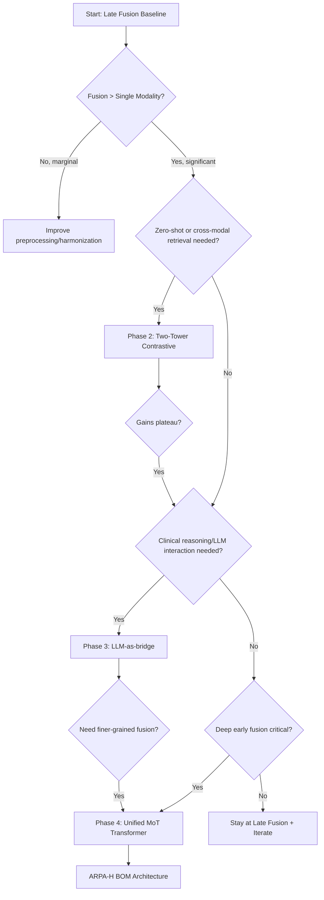

# Integration Baseline Plan

## Overview

This document outlines the **phased integration roadmap** for multimodal gene–brain–behavior fusion in the Neuro-Omics KB, informed by ensemble integration principles (Li et al. 2022), oncology multimodal reviews (Waqas et al. 2024), and emerging multimodal FM patterns (BAGEL, MoT, M3FM, Me-LLaMA, TITAN).

**Philosophy:** Start simple (late fusion), escalate strategically only when simpler methods show clear limitations or specific ARPA-H BOM goals require it.

---

## Where each step came from (paper → inference → our plan)

- Principle: Prefer late integration first under heterogeneous semantics.
  - Sources: Ensemble Integration (Li et al. 2022), Oncology multimodal review (2024).
  - Inference: Preserve modality-specific signal; avoid premature joint spaces.
  - Plan: Concatenate compact per-modality features; train LR and GBDT baselines.

- Robustness and evaluation discipline.
  - Sources: Oncology review; BrainLM/Brain-JEPA/Harmony practices.
  - Plan: Z-score + residualize per feature vs covariates; same CV folds; AUROC/AUPRC with CIs; DeLong/bootstrap for differences.

- CCA + permutation and partial correlations before heavy fusion.
  - Sources: Review guidance; neuro CCA tradition.
  - Plan: CCA on residualized, standardized inputs; 1,000 permutations; partial correlations/logistic with covariates.

- Modality sequencing.
  - Sources: Harmony, SwiFT, BrainLM/JEPA.
  - Plan: Start with sMRI ROIs; add fMRI as FC vectors; later consider brain FMs.

- Genetics embedding hygiene and attribution.
  - Sources: Caduceus (RC-equivariance), DNABERT-2, GENERator; BIOKDD'25 LOGO.
  - Plan: RC-average; deterministic tokenization; LOGO ΔAUC with Wilcoxon + FDR.

---

## Escalation Roadmap

### Phase 1: Late Fusion (Ensemble Integration — **Current baseline**)

**Mechanism:**
- Concatenate per-modality embeddings (gene 512-D + brain 512-D → 1024-D fusion vector)
- Train LR/GBDT on concatenated features
- Alternative: Train separate models per modality, then ensemble predictions (averaging, stacking)

**Success Criteria:**
- Fusion AUROC > max(Gene, Brain) with p < 0.05 (DeLong/bootstrap)
- Stable performance across CV folds

**Next Phase Trigger:**
- If fusion significantly outperforms single modalities → escalate to Phase 2
- If gains are marginal or site/confound effects dominate → consider harmonization or Phase 3

**References:**
- [Ensemble Integration card](../models/integrations/ensemble_integration.md)
- [Integration Strategy](../integration/integration_strategy.md)

---

### Phase 2: Two-Tower Contrastive Alignment (CLIP-style)

**Mechanism:**
- Freeze pre-trained gene FM and brain FM encoders
- Add small learnable projectors (MLP) for each modality
- Train with InfoNCE contrastive loss on paired (gene, brain) samples
- Enables zero-shot cross-modal retrieval and alignment

**When to Use:**
- Zero-shot transfer to new cohorts/domains
- When paired gene-brain data is limited but weakly paired data is abundant
- When interpretability of modality-specific contributions is critical

**Success Criteria:**
- Improved cross-modal retrieval metrics (recall@k)
- Better zero-shot performance on held-out cohorts
- Stable alignment in shared latent space

**Next Phase Trigger:**
- If contrastive alignment improves downstream tasks significantly
- If LLM-based reasoning or clinical explanations are needed → Phase 3
- If complex cross-modal interactions are hypothesized → Phase 4

**References:**
- [Multimodal FM Patterns card](../models/integrations/multimodal_fm_patterns.md) (Pattern 1: Two-Tower CLIP)
- [M3FM](../models/multimodal/m3fm.md), [TITAN](../models/multimodal/titan.md)

---

### Phase 3: LLM as Semantic Bridge

**Mechanism:**
- Project gene and brain embeddings into the token space of a medical LLM (e.g., Me-LLaMA)
- Use LLM as a semantic hub for multimodal reasoning, natural language queries, and clinical report generation
- Enables human-centric interaction with multimodal neuro-omics data

**When to Use:**
- Clinician-facing AI for explanation and query
- Multimodal clinical reasoning (gene risk + brain imaging + EHR)
- Low-resource language support (multilingual LLM)

**Success Criteria:**
- Improved clinical utility and interpretability
- Robust multimodal question answering
- Seamless integration of clinical text with omics/imaging data

**Next Phase Trigger:**
- If fine-grained, low-level feature fusion is needed → Phase 4
- If computational cost of large LLM is prohibitive → optimize or defer

**References:**
- [Multimodal FM Patterns card](../models/integrations/multimodal_fm_patterns.md) (Pattern 2: LLM-as-bridge)
- [Me-LLaMA](../models/multimodal/me_llama.md)

---

### Phase 4: Unified MoT-Style Multimodal Transformer (Deep Early Fusion)

**Mechanism:**
- Interleave gene, brain, and behavior tokens in a single unified transformer
- Use modality-aware sparse parameters (MoT architecture) for compute efficiency
- Global self-attention enables rich cross-modal interactions

**When to Use:**
- Large-scale multimodal pretraining from scratch (ARPA-H BOM)
- When deep, early fusion is hypothesized to capture critical gene-brain-behavior interactions
- When compute efficiency is paramount (MoT uses ~55% FLOPs vs dense transformer)

**Success Criteria:**
- Substantial gains over simpler fusion methods
- Efficient training on diverse multimodal corpora
- Unified understanding and generation capabilities

**Caution:**
- High complexity and resource requirements
- Only escalate here if Phases 1–3 show clear limitations

**References:**
- [Multimodal FM Patterns card](../models/integrations/multimodal_fm_patterns.md) (Pattern 3: Unified MoT)
- [BAGEL](../models/multimodal/bagel.md), [MoT](../models/multimodal/mot.md)

---

## Decision Tree

---

## Key Principles

1. **Start simple:** Late fusion (EI) establishes a robust baseline with minimal assumptions
2. **Escalate strategically:** Move to more complex patterns only when justified by specific limitations or BOM goals
3. **Preserve modality specificity:** Avoid premature joint spaces that may lose modality-specific signal
4. **Control confounds:** Residualize per modality before fusion; use group-aware CV
5. **Benchmark rigorously:** Use DeLong tests, bootstrapped CIs, permutation tests for statistical rigor
6. **Document decisions:** Log escalation criteria, success metrics, and failure modes in decision logs

---

## Related Resources

- [Integration Strategy](../integration/integration_strategy.md) — Overall fusion approach
- [Multimodal FM Patterns](../models/integrations/multimodal_fm_patterns.md) — Pattern catalog with BOM roadmap
- [Ensemble Integration](../models/integrations/ensemble_integration.md) — Late fusion implementation guide
- [Oncology Multimodal Review](../models/integrations/oncology_multimodal_review.md) — Cross-domain fusion cautions
- [Design Patterns](../integration/design_patterns.md) — General pattern taxonomy
