# Navigating the Neuro-Omics KB

This page orients new readers to the structure of the knowledge base, how the YAML cards feed into the rendered docs, and where to find integration-critical metadata for **gene–brain–behaviour foundation models**. The KB began with **adult UK Biobank–centric gene–brain FM alignment** (genetics FM + MRI Brain FM outputs) and now supports **developmental and neurodevelopmental longitudinal multimodal FMs** spanning MRI/fMRI Brain FMs, EEG/EPhys FMs, genetics / multi-omics FMs, and behavioural / developmental phenotypes.

## Architecture at a glance

```mermaid
flowchart LR
    A[External repos & datasets<br/>UKB · HCP · Gene FMs · Dev cohorts] --> B[Metadata curation<br/>kb/model_cards · kb/datasets]
    B --> C[Integration strategy & modality specs<br/>docs/integration/*]
    C --> D[Experiment configs<br/>configs/experiments/*.yaml]
    D --> E[Analysis outputs & decisions<br/>docs/decisions · docs/generated/*]
    B --> F[Embedding & harmonization registries<br/>kb/integration_cards/*.yaml]
    F --> G[Semantic / hub alignments<br/>LLM · VLM]
    G --> D
```



- **Source repos / datasets** live under `external_repos/` (git-ignored) and upstream storage (UKB, HCP, Cha Hospital developmental cohorts, and future ARPA-H Brain-Omics Model (BOM) data sources).
- **Metadata cards** (`kb/**`) are the single source of truth for model/dataset specs, including adult and developmental gene–brain–behaviour datasets.
- **Docs pages** (this site) summarize how to use those cards for integration.
- **Strategy registries** (embedding/harmonization/preprocessing) connect raw exports to subject-level vectors.
- **Semantic alignment / hub registries** describe how modalities (gene, brain, EEG, behaviour) are aligned to **LLM** and **VLM** spaces in ARPA-H–style Brain-Omics Model (BOM) projects.
- **Experiment configs** log the exact recipe IDs and folds before any analysis job starts.

## Core navigation map

???+ info "Critical sections"
    - **Decisions → Integration plan (Nov 2025)**: Phased escalation roadmap from late fusion → two-tower contrastive → LLM-as-bridge → unified MoT transformer, aligned with ARPA-H BOM design.
    - **Integration → Strategy**: Shared preprocessing doctrine, embedding policies, and escalation triggers.
    - **Integration → Analysis recipes**: Step-by-step guides for CCA+permutation, prediction baselines, partial correlations, and LOGO attribution.
    - **Integration → Modality features**: Per-modality feature prep with links to embedding strategy IDs (Genomics, sMRI, fMRI, and planned EEG / developmental behavioral specs).
    - **Integration → Embedding policies**: Naming conventions, PCA dimensionality policy, and version control for embedding strategies.
    - **Integration → Integration cards**: Multimodal FM patterns, ensemble integration, oncology multimodal review — distilled cross-domain lessons for ARPA-H BOM.
    - **Models**: Foundation models organized by domain:
        - **Genetics** (Caduceus, DNABERT-2, Evo2, GENERator)
        - **Brain** (BrainLM, Brain-JEPA, Brain Harmony, BrainMT, SwiFT)
        - **Multimodal & Clinical** (BAGEL, MoT, M3FM, Me-LLaMA, TITAN, FMS-Medical catalog)
    - **Data**: Governance/QC logs and schema maps, including UKB and future developmental / neurodevelopmental cohorts.
    - **Research Papers**: 22 structured paper summaries (genetics, brain, multimodal, integration methods, genomics/population).

## Metadata you must log per run

Use the CLI helpers to print the canonical recipes and copy their IDs into your run metadata:

```bash
# Embedding strategy (e.g., FreeSurfer PCA-512 for sMRI)
python scripts/manage_kb.py ops strategy smri_free_surfer_pca512_v1

# Harmonization method (e.g., MURD for T1/T2)
python scripts/manage_kb.py ops harmonization murd_t1_t2

# Preprocessing stack (e.g., HCP-like rs-fMRI for SwiFT)
python scripts/manage_kb.py ops strategy rsfmri_swift_segments_v1
```

**Record these IDs in every run:**

1. `embedding_strategies.<id>` for every modality in the experiment
2. `harmonization_methods.<id>` (even if it is `none_baseline`)
3. `rsfmri_preprocessing_pipelines.<id>` whenever an rs-fMRI FM is involved
4. CV scheme (`StratifiedGroupKFold`, seed, groups) and manifest used
5. Model versions and checkpoints (link to YAML cards in `kb/model_cards/`)

**Why this matters:**
- Reproducibility: Same strategy ID → same preprocessing → comparable results across runs
- Versioning: If preprocessing changes, increment the version suffix (e.g., `_v1` → `_v2`)
- Traceability: Link experiment configs back to KB metadata cards

## How content stays consistent

- **Template-first editing:** Every new card starts from templates in `kb/templates/` or `docs/models/integrations/template.md`
- **Docs ↔ YAML parity:** If a doc cites a field (e.g., embedding recipe level), the corresponding YAML must include it
- **Strict builds:** `mkdocs build --strict` guards against broken navigation before publishing
- **Quality gates:** Pre-commit hooks (`ruff`, `mypy`, `kb-validate-*`) catch errors early
- **Integration card curation:** New multimodal patterns are distilled into integration cards (e.g., `multimodal_fm_patterns.md`) to guide ARPA-H BOM design

## Suggested reading order

### 🆕 New to this KB
1. **KB overview (this page)** — Understand the structure and navigation map
2. **Integration plan (Nov 2025)** — Phased escalation roadmap with decision tree
3. **Model overviews** — Start with [Genetics](../models/genetics/index.md), [Brain](../models/brain/index.md), or [Multimodal](../models/multimodal/index.md)
4. **Code walkthrough** — Hands-on guide for your chosen FM (e.g., [Caduceus](../code_walkthroughs/caduceus_walkthrough.md), [BrainLM](../code_walkthroughs/brainlm_walkthrough.md))

### 🔬 Planning an analysis
1. **Integration strategy** — Big-picture fusion approach and embedding policies
2. **Modality features** — Per-modality prep for [Genomics](../integration/modality_features/genomics.md), [sMRI](../integration/modality_features/smri.md), [fMRI](../integration/modality_features/fmri.md)
3. **Analysis recipe** — Pick [CCA+permutation](../integration/analysis_recipes/cca_permutation.md), [Prediction baselines](../integration/analysis_recipes/prediction_baselines.md), or [LOGO](https://github.com/allison-eunse/neuro-omics-kb/blob/main/configs/experiments/03_logo_gene_attribution.yaml)
4. **Experiment config** — Clone a template from `configs/experiments/` and adapt to your cohort

### 📚 Exploring multimodal architectures
1. **Integration cards** — [Multimodal FM patterns](../models/integrations/multimodal_fm_patterns.md), [Ensemble integration](../models/integrations/ensemble_integration.md), [Oncology review](../models/integrations/oncology_multimodal_review.md)
2. **Design patterns** — [General taxonomy](../integration/design_patterns.md) and [Multimodal architectures](../integration/multimodal_architectures.md)
3. **Multimodal models** — [BAGEL](../models/multimodal/bagel.md), [MoT](../models/multimodal/mot.md), [M3FM](../models/multimodal/m3fm.md), [Me-LLaMA](../models/multimodal/me_llama.md), [TITAN](../models/multimodal/titan.md)

---

Use this map whenever you add new cards or plan analyses—it keeps the documentation, YAML metadata, and experiment configs aligned.

