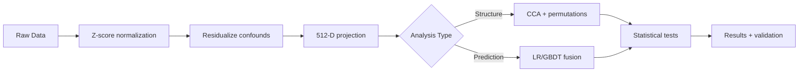

# 🧬🧠 Neuro-Omics Knowledge Base

[](https://allison-eunse.github.io/neuro-omics-kb/)
[](#foundation-models)
[](#research-papers)
[](#integration-strategies)

> **A comprehensive documentation hub for genetics and brain foundation models and their multimodal integration.**

[📖 KB Overview](guide/kb_overview/) | [🧬 Genetics Models](models/genetics/) | [🧠 Brain Models](models/brain/) | [🔗 Integration Guide](integration/integration_strategy/) | [💻 GitHub](https://github.com/allison-eunse/neuro-omics-kb)

---

## What is this?

A **documentation-first knowledge base** for researchers working with:
- 🧬 **Genetic foundation models** (Caduceus, DNABERT-2, Evo2, GENERator)
- 🧠 **Brain imaging models** (BrainLM, Brain-JEPA, BrainMT, Brain Harmony, SwiFT)
- 🏥 **Multimodal/Clinical models** (BAGEL, MoT, M3FM, Me-LLaMA, TITAN, FMS-Medical)
- 🔗 **Integration strategies** for gene-brain-behavior-language analysis

**Scope:** Documentation, metadata cards, and integration patterns — **not** model implementation code.

---

## 🚀 Quick Start

```bash
# 1. Clone and setup
git clone https://github.com/allison-eunse/neuro-omics-kb.git
cd neuro-omics-kb
python -m venv .venv && source .venv/bin/activate
pip install -r requirements.txt

# 2. View documentation locally
mkdocs serve
# Visit http://localhost:8000

# 3. Validate metadata cards
python scripts/manage_kb.py validate models
```

**New to foundation models?** Start with:

1. 📖 [KB Overview](guide/kb_overview/) - Understand the structure
2. 🧬 [Genetics Models Overview](models/genetics/) - DNA sequence models
3. 🧠 [Brain Models Overview](models/brain/) - Neuroimaging models
4. 🔗 [Integration Strategy](integration/integration_strategy/) - How to combine modalities

---

## 💡 Use Cases

<div class="grid cards" markdown>

-   :material-dna: **Genetics Research**

    ---

    **What you can do:**
    
    - Extract gene embeddings from DNA sequences
    - Analyze variant effects and predict phenotypes
    - Generate gene-level representations for downstream analysis

    [:octicons-arrow-right-24: Explore Genetics Models](models/genetics/)

-   :material-brain: **Brain Imaging**

    ---

    **What you can do:**
    
    - Process fMRI and sMRI neuroimaging data
    - Extract site-robust brain embeddings
    - Harmonize multi-site imaging datasets

    [:octicons-arrow-right-24: Explore Brain Models](models/brain/)

-   :material-link-variant: **Multimodal Integration**

    ---

    **What you can do:**
    
    - Fuse gene + brain embeddings via CCA or late fusion
    - Build gene-brain-behavior prediction models
    - Implement cross-modal alignment strategies

    [:octicons-arrow-right-24: Explore Integration Strategy](integration/integration_strategy/)

-   :material-hospital: **Multimodal & Clinical Models**

    ---

    **What you can do:**
    
    - Use unified multimodal architectures (BAGEL, MoT, M3FM)
    - Process medical imaging with clinical text (TITAN, M3FM)
    - Leverage medical LLMs for clinical reasoning (Me-LLaMA)
    - Explore foundation model catalogs (FMS-Medical)

    [:octicons-arrow-right-24: Explore Multimodal Models](models/multimodal/)

-   :material-flask: **Reproducible Research**

    ---

    **What you can do:**
    
    - Use validated analysis pipelines and recipes
    - Clone experiment configs with proper CV schemes
    - Apply quality gates for multi-site cohorts

    [:octicons-arrow-right-24: Explore Analysis Recipes](integration/analysis_recipes/cca_permutation/)

</div>

**Example workflows:**

- Gene-brain association discovery using WES + sMRI with CCA
- fMRI embedding extraction with BrainLM for MDD prediction
- Leave-one-gene-out (LOGO) attribution for gene importance
- Multimodal fusion for clinical decision support

---

## 📦 What's Inside

<details open>
<summary><b>📚 Documentation (docs/)</b></summary>

- **Code Walkthroughs** - Step-by-step guides for 15 foundation models with consistent formatting
  - 🧬 **Genetics** (4): Caduceus, DNABERT-2, GENERator, Evo 2
  - 🧠 **Brain** (5): BrainLM, Brain-JEPA, Brain Harmony, BrainMT, SwiFT
  - 🏥 **Multimodal/Clinical** (6): BAGEL, MoT, M3FM, Me-LLaMA, TITAN, FMS-Medical catalog
- **Integration Playbooks** - Multimodal fusion strategies (late fusion → contrastive → TAPE)
- **Data Schemas** - UK Biobank, HCP, developmental cohorts
- **Decision Logs** - Architectural choices and research rationale
- **Curated Papers** - PDFs + Markdown summaries in `docs/generated/kb_curated/`

</details>

<details>
<summary><b>🏷️ Metadata Cards (kb/)</b></summary>

- **Model Cards** (`model_cards/*.yaml`) - 15 model cards (13 FMs + 2 ARPA-H planning cards) with architecture specs, embedding recipes, integration hooks
- **Dataset Cards** (`datasets/*.yaml`) - Sample sizes, QC thresholds, access requirements
- **Paper Cards** (`paper_cards/*.yaml`) - 20 research papers with structured takeaways
- **Integration Cards** (`integration_cards/*.yaml`) - Embedding strategies, harmonization methods, preprocessing pipelines

[Browse all cards →](https://github.com/allison-eunse/neuro-omics-kb/tree/main/kb)

</details>

<details>
<summary><b>🔧 Tools & Scripts</b></summary>

- `scripts/manage_kb.py` - Validate YAML cards, query embedding strategies
- `scripts/codex_gate.py` - Quality gate for automated workflows
- `scripts/fetch_external_repos.sh` - Sync upstream model repositories

</details>

<details>
<summary><b>⚙️ Experiment Configs</b></summary>

Ready-to-run YAML templates in `configs/experiments/`:
- `01_cca_gene_smri.yaml` - CCA + permutation baseline
- `02_prediction_baselines.yaml` - Gene vs Brain vs Fusion
- `03_logo_gene_attribution.yaml` - Gene attribution protocol

</details>

---

## 🎯 Foundation Model Registry

### Genetics Models
| Model | Best for | Context | Quick link |
|-------|----------|---------|-----------|
| 🧬 [Caduceus](models/genetics/caduceus.md) | RC-equivariant gene embeddings | DNA sequences | [Walkthrough](code_walkthroughs/caduceus_walkthrough.md) |
| 🧬 [DNABERT-2](models/genetics/dnabert2.md) | Cross-species transfer | BPE tokenization | [Walkthrough](code_walkthroughs/dnabert2_walkthrough.md) |
| 🧬 [Evo 2](models/genetics/evo2.md) | Ultra-long regulatory regions | 1M context | [Walkthrough](code_walkthroughs/evo2_walkthrough.md) |
| 🧬 [GENERator](models/genetics/generator.md) | Generative modeling | 6-mer LM | [Walkthrough](code_walkthroughs/generator_walkthrough.md) |

### Brain Models
| Model | Modality | Best for | Quick link |
|-------|----------|----------|-----------|
| 🧠 [BrainLM](models/brain/brainlm.md) | fMRI | Site-robust embeddings | [Walkthrough](code_walkthroughs/brainlm_walkthrough.md) |
| 🧠 [Brain-JEPA](models/brain/brainjepa.md) | fMRI | Lower-latency option | [Walkthrough](code_walkthroughs/brainjepa_walkthrough.md) |
| 🧠 [Brain Harmony](models/brain/brainharmony.md) | sMRI + fMRI | Multi-modal fusion | [Walkthrough](code_walkthroughs/brainharmony_walkthrough.md) |
| 🧠 [BrainMT](models/brain/brainmt.md) | sMRI/fMRI | Mamba efficiency | [Walkthrough](code_walkthroughs/brainmt_walkthrough.md) |
| 🧠 [SwiFT](models/brain/swift.md) | fMRI | Hierarchical spatiotemporal | [Walkthrough](code_walkthroughs/swift_walkthrough.md) |

---

## 📋 Decisions & Roadmaps

- [Integration baseline plan (Nov 2025)](decisions/2025-11-integration-plan.md) — Late fusion first, then escalate if fusion wins.

---

## 🔗 Integration Stack

- **Integration strategy:** [integration/integration_strategy.md](integration/integration_strategy.md)
- **Analysis recipes:**
  - [CCA + permutation](integration/analysis_recipes/cca_permutation.md)
  - [Prediction baselines](integration/analysis_recipes/prediction_baselines.md)
  - [Partial correlations](integration/analysis_recipes/partial_correlations.md)
- **Modality features:**
  - [Genomics](integration/modality_features/genomics.md)
  - [sMRI](integration/modality_features/smri.md)
  - [fMRI](integration/modality_features/fmri.md)
- **Design patterns:** [integration/design_patterns.md](integration/design_patterns.md)
- **Multimodal architectures:** [integration/multimodal_architectures.md](integration/multimodal_architectures.md)

---

## 🏥 Multimodal & Clinical Models

Beyond genetics and brain FMs, the KB documents **multimodal architectures** that inform Brain-Omics Model (BOM) design:

### General Multimodal
| Model | Type | Key Innovation | Links |
|-------|------|----------------|-------|
| 🔗 [BAGEL](models/multimodal/bagel.md) | Unified FM | MoT experts (understanding + generation) | [Paper](generated/kb_curated/papers-md/bagel_2025.md) • [Walkthrough](code_walkthroughs/bagel_walkthrough.md) |
| 🔗 [MoT](models/multimodal/mot.md) | Sparse transformer | Modality-aware sparsity (~55% FLOPs) | [Paper](generated/kb_curated/papers-md/mot_2025.md) • [Walkthrough](code_walkthroughs/mot_walkthrough.md) |

### Medical & Clinical
| Model | Domain | Specialization | Links |
|-------|--------|----------------|-------|
| 🏥 [M3FM](models/multimodal/m3fm.md) | Radiology | CXR/CT + bilingual reports (EN/CN) | [Paper](generated/kb_curated/papers-md/m3fm_2025.md) • [Walkthrough](code_walkthroughs/m3fm_walkthrough.md) |
| 🏥 [Me-LLaMA](models/multimodal/me_llama.md) | Medical LLM | Continual pretrained LLaMA (129B tokens) | [Paper](generated/kb_curated/papers-md/me_llama_2024.md) • [Walkthrough](code_walkthroughs/melamma_walkthrough.md) |
| 🏥 [TITAN](models/multimodal/titan.md) | Pathology | Gigapixel whole-slide imaging | [Paper](generated/kb_curated/papers-md/titan_2025.md) • [Walkthrough](code_walkthroughs/titan_walkthrough.md) |

📖 **Explore more:**  
[Multimodal Models Overview](models/multimodal/index.md) • [Multimodal Architectures Guide](integration/multimodal_architectures.md) • [Design Patterns](integration/design_patterns.md)

---

## 📋 Research Papers

**20 structured paper cards** documenting:

- 🧬 **Genetics FMs** (4): Caduceus, DNABERT-2, Evo2, GENERator
- 🧠 **Brain FMs** (5): BrainLM, Brain-JEPA, Brain Harmony, BrainMT, SwiFT
- 🏥 **Multimodal/Clinical FMs** (5): BAGEL, MoT, M3FM, Me-LLaMA, TITAN
- 🔗 **Integration & Methods** (5): Ensemble integration, Multimodal FMs survey, MM-LLM imaging, Oncology review, Yoon BioKDD
- 🧬 **Genomics & Population** (2): GWAS diverse populations, PRS guide

[Browse all papers →](https://github.com/allison-eunse/neuro-omics-kb/tree/main/kb/paper_cards) | [View paper summaries →](https://github.com/allison-eunse/neuro-omics-kb/tree/main/docs/generated/kb_curated/papers-md)

<details>
<summary><strong>Detailed paper list</strong> — Click to expand</summary>

### 🧬 Genetics Foundation Models
| Paper | Year | Key Contribution |
|-------|------|------------------|
| [Caduceus](generated/kb_curated/papers-md/caduceus_2024.md) | 2024 | RC-equivariant bidirectional DNA FM |
| [Evo 2](generated/kb_curated/papers-md/evo2_2024.md) | 2024 | 1M context StripedHyena architecture |
| [GENERator](generated/kb_curated/papers-md/generator_2024.md) | 2024 | 6-mer generative DNA language model |

### 🧠 Brain Foundation Models
| Paper | Year | Key Contribution |
|-------|------|------------------|
| [BrainLM](generated/kb_curated/papers-md/brainlm_2024.md) | 2024 | ViT-MAE for fMRI with site robustness |
| [Brain-JEPA](generated/kb_curated/papers-md/brainjepa_2024.md) | 2024 | Joint-embedding predictive architecture |
| [Brain Harmony](generated/kb_curated/papers-md/brainharmony_2025.md) | 2025 | sMRI+fMRI fusion with TAPE tokens |
| [BrainMT](generated/kb_curated/papers-md/brainmt_2025.md) | 2025 | Hybrid Mamba-Transformer for efficiency |

### 🔗 Multimodal Integration
| Paper | Year | Key Contribution |
|-------|------|------------------|
| [BAGEL](generated/kb_curated/papers-md/bagel_2025.md) | 2025 | Unified understanding + generation with MoT |
| [MoT](generated/kb_curated/papers-md/mot_2025.md) | 2025 | Modality-aware sparse transformers |
| [M3FM](generated/kb_curated/papers-md/m3fm_2025.md) | 2025 | Multilingual medical vision-language |
| [Me-LLaMA](generated/kb_curated/papers-md/me_llama_2024.md) | 2024 | Medical LLM with continual pretraining |
| [TITAN](generated/kb_curated/papers-md/titan_2025.md) | 2025 | Whole-slide pathology vision-language |
| [Multimodal FMs](generated/kb_curated/papers-md/mmfm_2025.md) | 2025 | Survey of multimodal architectures |

### 🧪 Integration Methods & Evaluation
| Paper | Year | Key Contribution |
|-------|------|------------------|
| [Ensemble Integration (Li 2022)](generated/kb_curated/papers-md/ensemble_integration_li2022.md) | 2022 | Late fusion rationale and best practices |
| [Oncology Multimodal (Waqas 2024)](generated/kb_curated/papers-md/oncology_multimodal_waqas2024.md) | 2024 | Confounds and evaluation protocols |
| [Yoon BioKDD 2025](generated/kb_curated/papers-md/yoon_biokdd2025.md) | 2025 | Gene embeddings + LOGO attribution |

### 📊 Genomics & Population Methods
| Paper | Key Contribution |
|-------|------------------|
| [GWAS Diverse Populations](generated/kb_curated/papers-md/gwas_diverse_populations.md) | Ancestry control and bias mitigation |
| [PRS Guide](generated/kb_curated/papers-md/prs_guide.md) | Polygenic risk score methodology |

📋 **Full archive:** [Paper Cards (YAML)](https://github.com/allison-eunse/neuro-omics-kb/tree/main/kb/paper_cards) • [Paper PDFs](https://github.com/allison-eunse/neuro-omics-kb/tree/main/docs/generated/kb_curated/papers-pdf)

</details>

---

## 📊 Data & Schemas

| Resource | Description | Link |
|----------|-------------|------|
| 🏥 **UKB Data Map** | Field mappings, cohort definitions | [View](data/ukb_data_map.md) |
| ✅ **Governance & QC** | Quality control protocols, IRB guidelines | [View](data/governance_qc.md) |
| 🔑 **Subject Keys** | ID management and anonymization | [View](data/subject_keys.md) |
| 📋 **Schemas** | Data format specifications | [View](data/schemas.md) |
| 📦 **FMS-Medical Catalog** | 100+ medical FM references | [View](models/multimodal/fms_medical.md) |

!!! info "Planned Additions"
    Developmental cohort cards (Cha Hospital longitudinal studies) and additional neurodevelopmental datasets coming soon.

---

## 🗂️ KB Assets

<div class="grid cards" markdown>

-   :material-file-document: **Model Cards**

    ---

    15 model cards: 13 foundation models + 2 ARPA-H planning cards

    [:octicons-arrow-right-24: Browse on GitHub](https://github.com/allison-eunse/neuro-omics-kb/tree/main/kb/model_cards)

-   :material-book-open-page-variant: **Paper Cards**

    ---

    Structured summaries of 20 key papers with integration hooks

    [:octicons-arrow-right-24: Browse on GitHub](https://github.com/allison-eunse/neuro-omics-kb/tree/main/kb/paper_cards)

-   :material-database: **Dataset Cards**

    ---

    Data source specifications for UKB, HCP, and benchmarks

    [:octicons-arrow-right-24: Browse on GitHub](https://github.com/allison-eunse/neuro-omics-kb/tree/main/kb/datasets)

-   :material-link-variant: **Integration Cards**

    ---

    Cross-modal fusion patterns and actionable guidance

    [:octicons-arrow-right-24: Browse on GitHub](https://github.com/allison-eunse/neuro-omics-kb/tree/main/kb/integration_cards)

</div>

---

## ⚙️ Experiment Configs

Ready-to-use analysis templates with validation schemas:

| Template | Purpose | Key Features |
|----------|---------|--------------|
| 📊 **01_cca_gene_smri** | CCA + permutation baseline | Cross-modal null distributions, p-values |
| 🎯 **02_prediction_baselines** | Gene vs Brain vs Fusion | LR/GBDT comparison, DeLong tests |
| 🧬 **03_logo_gene_attribution** | LOGO ΔAUC protocol | Leave-one-gene-out attribution |

[:octicons-arrow-right-24: Browse all configs on GitHub](https://github.com/allison-eunse/neuro-omics-kb/tree/main/configs/experiments)

---

## 🚀 Quick Start Guide

### Standard Pipeline



### Essential Controls

!!! warning "Always Residualize"
    **Confounds to control:**
    - Age, sex, site/scanner
    - Motion (mean FD for fMRI)
    - SES, genetic PCs
    - Batch effects

### Integration Roadmap

```
Late Fusion (baseline)
    ↓ If fusion wins significantly
Two-Tower Contrastive
    ↓ If gains plateau
EI Stacking / Hub Tokens
    ↓ Last resort
Full Early Fusion (TAPE-style)
```

!!! tip "Start with CCA + Permutation"
    CCA always returns non-zero correlations, even on shuffled data. The permutation test builds a **null distribution** by re-fitting after within-fold shuffling, giving you p-values to avoid over-interpreting noise—critical when sites share confounds.

---

## 🛠️ Typical Workflow

1. **📖 Explore** — Browse model cards and paper summaries
2. **🔍 Select** — Choose appropriate FMs for your modalities
3. **⚙️ Configure** — Clone experiment config template
4. **▶️ Run** — Extract embeddings and run analysis
5. **✅ Validate** — Use quality gates (`manage_kb.py`)
6. **📝 Document** — Log results back to KB

**Need help?** Check the [KB Overview](guide/kb_overview.md) or explore [Code Walkthroughs](code_walkthroughs/index.md)
